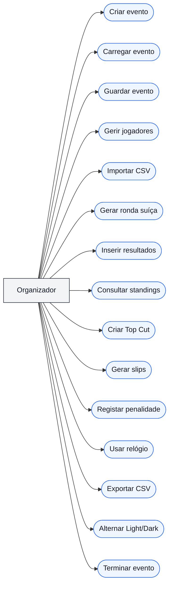
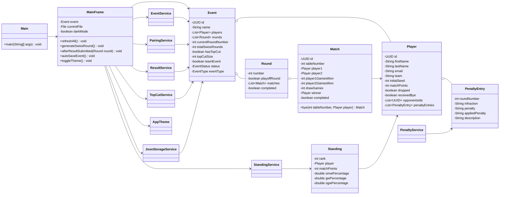

# Relatório de Projeto: MTG Event Manager

## 1. Identificação do Projeto

**Nome do projeto:** MTG Event Manager  
**Linguagem utilizada:** Java  
**Interface gráfica:** Java Swing  
**Paradigma principal:** Programação Orientada a Objetos  
**Gestor de dependências:** Maven  
**Persistência:** Ficheiros JSON com Gson  
**Versão do projeto:** 3.1  
**Pacote base:** `pt.premodern.eventmanager`  
**Tema:** Gestão de torneios de *Magic: The Gathering*

Este relatório descreve o desenvolvimento da aplicação **MTG Event Manager**, criada no âmbito da unidade curricular de Programação Orientada a Objetos. O programa permite organizar torneios de *Magic: The Gathering*, gerir jogadores, gerar rondas suíças, inserir resultados, calcular classificações, criar Top Cut, registar penalidades, usar relógio de ronda, guardar eventos em ficheiro JSON e exportar dados para CSV.

O objetivo principal do projeto é aplicar conceitos fundamentais de Programação Orientada a Objetos num contexto prático. A aplicação tem uma interface gráfica completa, separação por pacotes, classes de domínio, serviços com regras de negócio e persistência local dos dados.

## 2. Introdução

Num torneio de *Magic: The Gathering*, especialmente em eventos com várias rondas, é necessário controlar muitos dados ao mesmo tempo:

- lista de jogadores;
- rondas geradas;
- emparelhamentos;
- resultados de cada mesa;
- pontos dos jogadores;
- desempates;
- penalidades;
- jogadores que abandonaram o evento;
- Top Cut;
- tempo de ronda;
- ficheiros de evento para guardar e continuar mais tarde.

Fazer tudo manualmente pode causar erros, principalmente quando existem muitos jogadores. O **MTG Event Manager** resolve este problema através de uma aplicação desktop em Java, com uma interface Swing organizada em painéis.

O programa foi pensado para ser usado por um organizador de torneios. Esse utilizador pode criar um evento, adicionar jogadores, gerar rondas suíças, inserir resultados e acompanhar a classificação. Também pode guardar o evento em ficheiro e voltar a carregá-lo mais tarde.

## 3. Objetivos do Projeto

Os objetivos principais são:

1. Criar uma aplicação Java funcional com interface gráfica.
2. Aplicar os principais conceitos de Programação Orientada a Objetos.
3. Representar jogadores, eventos, rondas, partidas, resultados e penalidades como objetos.
4. Separar a interface gráfica das regras de negócio.
5. Implementar geração de rondas suíças.
6. Calcular classificações e desempates.
7. Permitir Top Cut após a fase suíça.
8. Guardar e carregar eventos usando JSON.
9. Implementar autosave para reduzir o risco de perda de dados.
10. Exportar informação importante em CSV.
11. Criar uma interface clara, com modo Light e Dark.

Como objetivo secundário, o projeto procura aproximar o trabalho académico de uma aplicação real, útil para organizadores de eventos de cartas.

## 4. Contexto do Problema

Em torneios de *Magic: The Gathering*, o formato suíço é muito comum. Neste formato, todos os jogadores participam em várias rondas e são emparelhados com adversários com pontuação semelhante. Normalmente:

- uma vitória vale 3 pontos;
- um empate vale 1 ponto;
- uma derrota vale 0 pontos;
- um bye conta como vitória;
- os jogadores não devem repetir adversários, sempre que possível;
- em eventos por equipas, deve evitar-se emparelhar jogadores da mesma equipa;
- no final, a classificação usa pontos e desempates.

Além disso, alguns eventos têm Top Cut. Nesses casos, os melhores classificados após a fase suíça passam a uma fase eliminatória.

A aplicação implementa estas ideias de forma simplificada, mas suficientemente completa para demonstrar conceitos importantes de programação.

## 5. Requisitos Funcionais

Os requisitos funcionais indicam aquilo que o sistema deve permitir fazer.

| Código | Requisito |
| --- | --- |
| RF01 | Criar um novo evento suíço. |
| RF02 | Criar um evento suíço com Top Cut. |
| RF03 | Definir se o evento é individual ou por equipas. |
| RF04 | Adicionar, editar, remover e dropar jogadores. |
| RF05 | Importar jogadores a partir de CSV. |
| RF06 | Validar dados dos jogadores, incluindo e-mail obrigatório e único. |
| RF07 | Calcular automaticamente o número de rondas suíças conforme o número de jogadores. |
| RF08 | Gerar a próxima ronda suíça. |
| RF09 | Evitar repetir adversários sempre que possível. |
| RF10 | Evitar emparelhar jogadores da mesma equipa sempre que possível. |
| RF11 | Atribuir bye quando existe número ímpar de jogadores ativos. |
| RF12 | Inserir ou alterar resultados das partidas. |
| RF13 | Marcar drops a partir da área de resultados. |
| RF14 | Calcular pontos de partida e estatísticas de jogos. |
| RF15 | Calcular standings com OMW%, GW% e OGW%. |
| RF16 | Apresentar standings individuais e standings por equipa. |
| RF17 | Criar Top Cut após a fase suíça. |
| RF18 | Gerar rondas seguintes do Top Cut. |
| RF19 | Identificar vencedor do evento. |
| RF20 | Registar penalidades para jogadores. |
| RF21 | Aplicar penalidades como Warning, Game Loss, Match Loss e Disqualification. |
| RF22 | Guardar histórico de penalidades por jogador. |
| RF23 | Usar relógio de ronda com alerta sonoro no fim do tempo. |
| RF24 | Gerar slips de resultados para impressão. |
| RF25 | Guardar e carregar eventos em JSON. |
| RF26 | Fazer autosave após alterações importantes. |
| RF27 | Exportar jogadores, pairings, standings e resultados para CSV. |
| RF28 | Alternar entre modo Light e modo Dark. |
| RF29 | Bloquear `Create New Event` após criação ou carregamento de um evento. |
| RF30 | Reativar `Create New Event` apenas depois de clicar em `End Current Event`. |

## 6. Requisitos Não Funcionais

Os requisitos não funcionais descrevem qualidades esperadas.

| Código | Requisito |
| --- | --- |
| RNF01 | O programa deve ser desenvolvido em Java. |
| RNF02 | A interface deve usar Java Swing. |
| RNF03 | O código deve estar organizado em pacotes com responsabilidades diferentes. |
| RNF04 | A aplicação deve aplicar encapsulamento e separação de responsabilidades. |
| RNF05 | A persistência deve ser local e fácil de transportar. |
| RNF06 | O programa deve ser executável com Maven. |
| RNF07 | Os dados devem ser guardados em formato legível, neste caso JSON. |
| RNF08 | O programa deve evitar perda de dados através de autosave. |
| RNF09 | A interface deve ser compreensível para utilizadores não técnicos. |
| RNF10 | O código deve ser legível e adequado a um projeto académico de POO. |

## 7. Atores do Sistema

O sistema tem um ator principal.

| Ator | Descrição |
| --- | --- |
| Organizador | Pessoa responsável por criar o evento, gerir jogadores, gerar rondas, inserir resultados, aplicar penalidades e guardar o ficheiro do torneio. |

Não existe sistema de login nem diferentes níveis de permissões. A aplicação é uma ferramenta local para o organizador.

## 8. User Stories

As user stories ajudam a explicar o programa do ponto de vista do utilizador.

1. Como organizador, quero criar um evento para começar a gerir um torneio.
2. Como organizador, quero adicionar jogadores para gerar rondas corretamente.
3. Como organizador, quero importar jogadores por CSV para poupar tempo.
4. Como organizador, quero gerar a próxima ronda suíça automaticamente.
5. Como organizador, quero inserir resultados para atualizar pontos e standings.
6. Como organizador, quero ver standings para saber a classificação atual.
7. Como organizador, quero criar Top Cut para eventos com fase eliminatória.
8. Como organizador, quero registar penalidades para manter histórico disciplinar.
9. Como organizador, quero guardar e carregar eventos para continuar o torneio mais tarde.
10. Como organizador, quero autosave para evitar perder dados por esquecimento.
11. Como organizador, quero alternar entre modo claro e escuro para melhorar a visualização.

## 9. Diagrama de Casos de Uso



## 10. Estrutura do Projeto

O código-fonte está organizado no pacote base:

`src/main/java/pt/premodern/eventmanager`

| Pacote | Responsabilidade |
| --- | --- |
| `pt.premodern.eventmanager` | Classe `Main`, ponto de entrada da aplicação. |
| `model` | Classes que representam os dados principais do domínio. |
| `service` | Regras de negócio, cálculos, geração de rondas e penalidades. |
| `persistence` | Gravação e carregamento de dados em JSON. |
| `ui` | Interface gráfica em Swing. |

Esta separação é uma boa prática porque evita concentrar todo o código numa única classe. Cada pacote tem uma função clara.

## 11. Arquitetura da Aplicação

A aplicação segue uma arquitetura simples em camadas.

| Camada | Classes principais | Função |
| --- | --- | --- |
| Interface gráfica | `MainFrame`, `EventPanel`, `PlayerPanel`, `PairingsPanel`, `ResultsPanel`, `StandingsPanel`, `TopCutPanel`, `ClockPanel`, `PenaltyEntryDialog` | Mostrar informação ao utilizador e receber ações. |
| Serviços | `EventService`, `PairingService`, `ResultService`, `StandingService`, `TopCutService`, `PenaltyService` | Executar regras de negócio. |
| Persistência | `JsonStorageService` | Guardar e carregar eventos em JSON. |
| Modelo | `Event`, `Player`, `Round`, `Match`, `Standing`, `PenaltyEntry`, `MatchResult` | Representar os dados do torneio. |
| Arranque | `Main` | Iniciar a aplicação Swing. |

O fluxo geral é:

1. O utilizador clica num botão ou altera um campo na interface.
2. O painel Swing chama um método da `MainFrame` ou de um serviço.
3. O serviço valida dados e altera objetos do modelo.
4. A `MainFrame` atualiza todos os painéis.
5. O autosave grava o evento no ficheiro JSON.

Esta organização ajuda a manter a interface separada da lógica. Por exemplo, o cálculo de standings não está dentro da tabela Swing; está no `StandingService`.

## 12. Diagrama de Classes

O diagrama seguinte mostra as classes principais. Não inclui todos os atributos e métodos, para manter a leitura simples.



## 13. Modelo de Domínio

O modelo de domínio representa os conceitos principais do torneio.

### 13.1. `Event`

A classe `Event` representa o torneio. Guarda:

- nome do evento;
- lista de jogadores;
- lista de rondas;
- ronda atual;
- número total de rondas suíças;
- informação sobre Top Cut;
- indicação se é evento por equipas;
- estado do evento;
- tipo de evento.

Esta classe funciona como o objeto principal que agrega os dados do torneio.

### 13.2. `Player`

A classe `Player` representa um jogador. Guarda dados pessoais e dados competitivos:

- nome;
- e-mail;
- equipa;
- seed inicial;
- pontos;
- jogos ganhos, perdidos e empatados;
- adversários anteriores;
- estado de drop;
- informação sobre bye;
- histórico de penalidades.

O uso de uma classe própria para jogadores permite guardar tanto dados administrativos como dados de torneio.

### 13.3. `Round`

A classe `Round` representa uma ronda do evento. Pode ser:

- ronda suíça;
- ronda de Top Cut.

Cada ronda contém uma lista de `Match`. A ronda também sabe se está completa.

### 13.4. `Match`

A classe `Match` representa uma partida entre dois jogadores. Guarda:

- número da mesa;
- jogador 1;
- jogador 2;
- jogos ganhos por cada jogador;
- jogos empatados;
- vencedor;
- estado de conclusão.

Também existe suporte para bye, em que um jogador recebe vitória automática.

### 13.5. `Standing`

A classe `Standing` representa uma linha da classificação. Guarda:

- posição;
- jogador;
- pontos;
- OMW%;
- GW%;
- OGW%.

Estes valores são calculados pelo `StandingService`.

### 13.6. `PenaltyEntry`

A classe `PenaltyEntry` guarda uma penalidade aplicada a um jogador. Contém:

- ronda;
- infração;
- penalidade escolhida;
- penalidade realmente aplicada;
- descrição.

Esta separação permite manter um histórico por jogador.

## 14. Estados do Evento

O estado do evento é representado pelo enum `EventStatus`.

| Estado | Significado |
| --- | --- |
| `CREATED` | Evento criado, mas ainda sem rondas iniciadas. |
| `SWISS_IN_PROGRESS` | Fase suíça em andamento. |
| `SWISS_COMPLETED` | Fase suíça terminada. |
| `TOP_CUT_IN_PROGRESS` | Fase eliminatória em andamento. |
| `FINISHED` | Evento terminado. |

Usar um enum é melhor do que usar textos soltos, porque evita erros como escrever estados de formas diferentes.

## 15. Tipos de Evento

O enum `EventType` define se o evento é:

- apenas suíço;
- suíço com Top Cut.

Esta decisão afeta o comportamento do programa, principalmente no fim das rondas suíças.

## 16. Serviços e Regras de Negócio

As regras de negócio estão separadas em classes de serviço.

### 16.1. `EventService`

Responsável por:

- criar eventos;
- calcular número de rondas suíças;
- adicionar, editar e remover jogadores;
- importar jogadores por CSV;
- exportar dados para CSV;
- validar e-mails;
- impedir alterações de jogadores depois de o evento começar.

Exemplo de regra importante: um jogador não pode ser adicionado com e-mail inválido ou repetido.

### 16.2. `PairingService`

Responsável por gerar rondas suíças.

Principais regras:

- na primeira ronda, os jogadores são baralhados;
- nas rondas seguintes, os jogadores são ordenados por pontos;
- jogadores com pontuação semelhante são emparelhados;
- tenta evitar adversários repetidos;
- tenta evitar jogadores da mesma equipa;
- atribui bye a um jogador quando há número ímpar de jogadores ativos.

Esta classe mostra bem a separação de responsabilidades: a interface não precisa saber como os emparelhamentos são calculados.

### 16.3. `ResultService`

Responsável por:

- inserir resultados;
- recalcular pontos;
- atualizar vencedores;
- atualizar estatísticas de jogos;
- recalcular o evento quando necessário.

Isto é importante porque os pontos não devem ser atualizados manualmente em vários sítios diferentes. A regra fica centralizada.

### 16.4. `StandingService`

Responsável por calcular classificações.

Os critérios usados são:

1. pontos de partida;
2. OMW%;
3. GW%;
4. OGW%;
5. seed inicial.

Também calcula standings por equipa, agrupando jogadores pelo campo `team`.

### 16.5. `TopCutService`

Responsável pela fase eliminatória.

Principais funções:

- criar o Top Cut inicial;
- selecionar jogadores com base nos standings;
- gerar rondas seguintes;
- identificar campeão.

### 16.6. `PenaltyService`

Responsável por:

- registar penalidades;
- aplicar upgrades de penalidades repetidas;
- aplicar Game Loss;
- aplicar Match Loss;
- aplicar Disqualification;
- dropar jogador quando necessário.

Esta classe demonstra como uma regra específica do domínio pode ficar isolada da interface.

## 17. Geração de Rondas Suíças

A geração de rondas segue uma lógica simples:

1. Confirmar que o evento existe e ainda aceita rondas suíças.
2. Confirmar que a ronda atual está completa.
3. Obter jogadores ativos.
4. Se for a primeira ronda, baralhar jogadores.
5. Se não for a primeira ronda, ordenar por pontos.
6. Se o número de jogadores for ímpar, atribuir bye.
7. Criar pares de jogadores.
8. Guardar a ronda no evento.
9. Atualizar o estado para `SWISS_IN_PROGRESS`.
10. Fazer autosave.

O emparelhamento usa penalizações internas para escolher o melhor adversário possível. Repetir adversário tem penalização alta, e jogar contra colega da mesma equipa também é evitado.

## 18. Resultados e Pontuação

Os resultados podem ser inseridos no painel `ResultsPanel`.

Regras principais:

- vitória dá 3 pontos;
- empate dá 1 ponto;
- derrota dá 0 pontos;
- bye dá vitória automática;
- Top Cut usa lógica eliminatória;
- quando uma ronda fica completa, o evento pode avançar de estado.

Sempre que um resultado é inserido ou alterado, o programa recalcula o evento e grava automaticamente.

## 19. Standings e Desempates

O programa calcula:

- **Match Points:** pontos totais do jogador;
- **OMW%:** percentagem média de vitórias dos adversários;
- **GW%:** percentagem de jogos ganhos;
- **OGW%:** percentagem média de jogos ganhos pelos adversários.

O `StandingService` usa um valor mínimo de 33% para percentagens de adversários, uma prática comum em sistemas de torneios para evitar desempates demasiado baixos.

## 20. Penalidades

O sistema de penalidades permite escolher:

- `Warning`;
- `Game Loss`;
- `Match Loss`;
- `Disqualification`.

Se um jogador receber um `Warning` repetido para a mesma infração, o programa pode aplicar automaticamente `Game Loss`.

Quando a penalidade afeta uma partida:

- `Game Loss` adiciona uma vitória de jogo ao adversário;
- `Match Loss` dá a partida ao adversário;
- `Disqualification` pode dropar o jogador do evento.

O histórico fica associado ao jogador.

## 21. Interface Gráfica

A interface foi criada com Java Swing.

Principais classes:

| Classe | Função |
| --- | --- |
| `MainFrame` | Janela principal, menus, navegação lateral e coordenação geral. |
| `EventInfoPanel` | Cabeçalho com nome do evento, estado, jogadores ativos, ronda e relógio. |
| `EventPanel` | Criação e configuração do evento. |
| `PlayerPanel` | Gestão de jogadores. |
| `PairingsPanel` | Visualização de emparelhamentos por ronda. |
| `ResultsPanel` | Inserção de resultados. |
| `StandingsPanel` | Classificações individuais e por equipa. |
| `TopCutPanel` | Gestão do Top Cut. |
| `ClockPanel` | Relógio de ronda. |
| `PenaltyEntryDialog` | Registo de penalidades. |
| `MatchSlipPreviewDialog` | Pré-visualização e impressão de slips. |
| `AppTheme` | Tema visual Light/Dark. |

O programa usa uma sidebar em vez de apenas tabs. Esta escolha aproxima a interface de um dashboard moderno e facilita o acesso às áreas principais.

## 22. Tema Light/Dark

A aplicação tem dois modos visuais:

- **Light:** modo inicial do programa;
- **Dark:** modo alternativo para ambientes com menos luz ou preferência visual.

O botão no cabeçalho permite alternar entre os dois modos. A classe `AppTheme` concentra as cores e estilos, evitando repetir cores em todos os painéis.

Esta é uma boa prática porque, se for necessário alterar uma cor, a alteração pode ser feita num único local.

## 23. Proteção contra Criação Acidental de Evento

Uma alteração importante foi a proteção do botão `Create New Event`.

Funcionamento:

1. Quando o programa abre, o botão está disponível.
2. Depois de criar um evento, `Create New Event` fica desativado.
3. Surge o botão `End Current Event`.
4. Ao carregar um evento existente, acontece o mesmo bloqueio.
5. Só depois de clicar em `End Current Event` é possível criar outro evento.

Esta regra evita que o organizador apague ou substitua sem querer um evento em andamento.

## 24. Persistência de Dados

A persistência é feita pela classe `JsonStorageService`, usando a biblioteca Gson.

O evento completo é guardado em JSON, incluindo:

- dados do evento;
- jogadores;
- rondas;
- partidas;
- resultados;
- penalidades;
- estado do evento.

Quando um ficheiro é carregado, o programa religa referências entre partidas e jogadores. Isto é necessário porque, ao gravar em JSON, alguns objetos podem ser recriados em memória ao carregar o ficheiro.

## 25. Autosave

O programa tem autosave para reduzir o risco de perda de dados.

O autosave acontece quando:

- um evento é criado;
- jogadores são adicionados;
- jogadores são editados;
- jogadores são removidos;
- jogadores são dropados;
- jogadores são importados por CSV;
- uma ronda é gerada;
- um resultado é inserido ou alterado;
- uma penalidade é inserida;
- o evento é terminado.

Se já existir um ficheiro atual, o autosave atualiza esse ficheiro. Se ainda não existir ficheiro, o programa cria um ficheiro com o nome seguro do evento e sufixo `-autosave.json`.

## 26. Exportação CSV

O programa permite exportar:

- lista de jogadores;
- emparelhamentos da ronda atual;
- standings;
- resultados.

CSV é um formato simples e útil porque pode ser aberto em programas como Excel, LibreOffice Calc ou Google Sheets.

## 27. Impressão de Slips

A classe `MatchSlipPreviewDialog` gera uma pré-visualização de slips de resultados. Estes slips podem ser impressos em A4.

Cada slip contém informação da ronda, mesa, jogadores, equipas, pontos antes da ronda e espaço para assinaturas.

Esta funcionalidade aproxima o programa de uma utilização real em torneios presenciais.

## 28. Relógio de Ronda

O `ClockPanel` permite:

- definir duração da ronda;
- iniciar;
- pausar;
- reiniciar;
- mostrar tempo restante no cabeçalho;
- tocar som quando a ronda termina.

O som está guardado nos recursos do projeto em:

`src/main/resources/audio/round_over.mp3`

## 29. Aplicação dos Pilares da POO

### 29.1. Encapsulamento

O encapsulamento aparece quando os atributos das classes são privados e o acesso é feito por métodos.

Exemplos:

- `Event` guarda listas de jogadores e rondas.
- `Player` controla os seus dados através de getters e setters.
- `Match` guarda resultado e vencedor.

Isto evita que o resto do programa dependa diretamente da estrutura interna dos objetos.

### 29.2. Abstração

A abstração aparece quando uma classe representa uma ideia do mundo real.

Exemplos:

- `Event` abstrai um torneio;
- `Player` abstrai um jogador;
- `Round` abstrai uma ronda;
- `Match` abstrai uma partida;
- `Standing` abstrai uma linha de classificação.

O programador não trabalha apenas com variáveis soltas; trabalha com objetos que têm significado.

### 29.3. Herança

O projeto usa herança principalmente de forma indireta através de Java Swing. Por exemplo:

- `MainFrame` herda de `JFrame`;
- `EventPanel`, `PlayerPanel`, `ResultsPanel` e outros painéis herdam de `JPanel`;
- `PenaltyEntryDialog` herda de `JDialog`.

Isto permite criar componentes gráficos personalizados usando classes já existentes da biblioteca Java.

### 29.4. Polimorfismo

O polimorfismo aparece no uso de componentes Swing e interfaces da própria linguagem.

Exemplos:

- vários painéis são tratados como `Component`;
- tabelas usam renderers;
- listeners de botões executam ações diferentes através de `ActionListener`;
- menus usam o mesmo método auxiliar `item`, mas cada item executa uma ação diferente.

Este conceito permite escrever código mais flexível.

## 30. Outros Conceitos de Programação Usados

### 30.1. Coleções

O projeto usa várias coleções Java:

- `List` para jogadores, rondas, partidas e penalidades;
- `Map` para ligar jogadores por `UUID`;
- `Set` para verificar dados em importação CSV.

Coleções são essenciais para gerir vários objetos.

### 30.2. UUID

O projeto usa `UUID` para identificar jogadores, partidas e eventos. Isto reduz o risco de IDs repetidos.

### 30.3. Streams

O projeto usa streams em várias situações, por exemplo:

- filtrar jogadores ativos;
- contar partidas abertas;
- calcular médias;
- agrupar jogadores por equipa.

Streams tornam algumas operações sobre listas mais compactas.

### 30.4. Exceções

O programa usa exceções para sinalizar erros, como:

- e-mail inválido;
- tentativa de gerar ronda sem jogadores suficientes;
- tentativa de alterar jogadores depois de o evento começar;
- penalidade que precisa de adversário mas não tem partida válida.

A interface apanha estas exceções e mostra uma mensagem ao utilizador.

## 31. Boas Práticas Utilizadas

Foram aplicadas várias boas práticas:

- separação por pacotes;
- separação entre interface, serviço, modelo e persistência;
- nomes de classes relacionados com o domínio;
- uso de enums para estados e tipos fixos;
- validação de dados antes de alterar o modelo;
- autosave em operações importantes;
- exportação em formatos simples;
- tema visual centralizado em `AppTheme`;
- uso de Maven para compilar e gerir dependências;
- uso de JSON para persistência legível;
- uso de métodos pequenos sempre que possível.

## 32. Limitações Atuais

Apesar de funcional, o projeto ainda tem limitações:

- não existe base de dados;
- não existe sistema multiutilizador;
- não existe autenticação de organizadores;
- não existem testes automatizados no projeto;
- o algoritmo suíço é uma aproximação e não substitui software oficial;
- a interface é desktop, não web;
- algumas regras oficiais de torneios podem não estar totalmente implementadas;
- o autosave depende de ficheiros locais.

Estas limitações são aceitáveis num projeto académico inicial, mas mostram caminhos de evolução.

## 33. Possíveis Melhorias Futuras

Algumas melhorias possíveis:

1. Criar testes unitários para serviços como `PairingService`, `StandingService` e `PenaltyService`.
2. Adicionar base de dados SQLite.
3. Criar histórico de alterações.
4. Melhorar validação de CSV.
5. Adicionar pesquisa e filtros mais avançados.
6. Permitir configuração personalizada de pontos.
7. Permitir formatos diferentes de torneio.
8. Exportar relatórios completos em PDF.
9. Melhorar regras de emparelhamento suíço.
10. Adicionar internacionalização para português e inglês.
11. Criar instalador da aplicação.
12. Guardar preferências do utilizador, como o modo Light/Dark.

## 34. Como Compilar e Executar

O projeto usa Maven.

Para executar:

```powershell
mvn clean compile exec:java
```

Para gerar o ficheiro JAR:

```powershell
mvn clean package
```

Também é possível compilar diretamente com `javac`, desde que a dependência Gson esteja no classpath.

## 35. Dependências

O projeto usa a biblioteca:

| Dependência | Função |
| --- | --- |
| Gson 2.11.0 | Converter objetos Java para JSON e JSON para objetos Java. |

O Maven também configura:

- `maven-compiler-plugin`;
- `maven-surefire-plugin`;
- `exec-maven-plugin`.

## 36. Conclusão

O projeto **MTG Event Manager** demonstra a aplicação prática de Programação Orientada a Objetos numa aplicação Java com interface gráfica. O programa tem um domínio claro, com classes como `Event`, `Player`, `Round`, `Match` e `PenaltyEntry`, e separa regras de negócio em serviços próprios.

Uma parte importante do projeto é a separação entre a interface Swing e a lógica do torneio. Esta separação torna o código mais fácil de compreender e alterar. Por exemplo, o cálculo dos standings está no `StandingService`, enquanto a tabela visual está no `StandingsPanel`.

O projeto também mostra conceitos úteis para um aluno de primeiro ano, como encapsulamento, classes, objetos, enums, listas, ficheiros, exceções, eventos de botões e organização por pacotes.

Na minha opinião, o ponto mais forte da aplicação é juntar vários conceitos num programa funcional: criação de eventos, gestão de jogadores, rondas suíças, resultados, penalidades, Top Cut, persistência, autosave e interface gráfica. Ainda há melhorias possíveis, especialmente testes e base de dados, mas a estrutura atual já permite evoluir o programa de forma organizada.

## 37. Bibliografia e Referências

- Documentação oficial do Java: https://docs.oracle.com/en/java/
- Documentação Java Swing: https://docs.oracle.com/javase/tutorial/uiswing/
- Documentação Maven: https://maven.apache.org/
- Documentação Gson: https://github.com/google/gson
- Documentação Mermaid: https://mermaid.js.org/
- Código-fonte do projeto MTG Event Manager.
